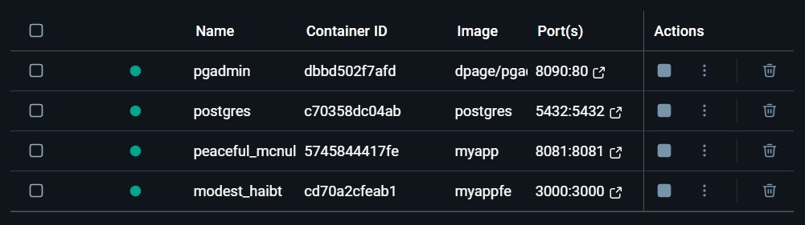
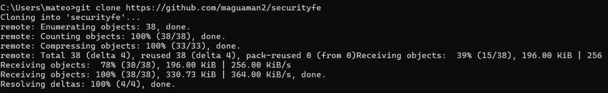
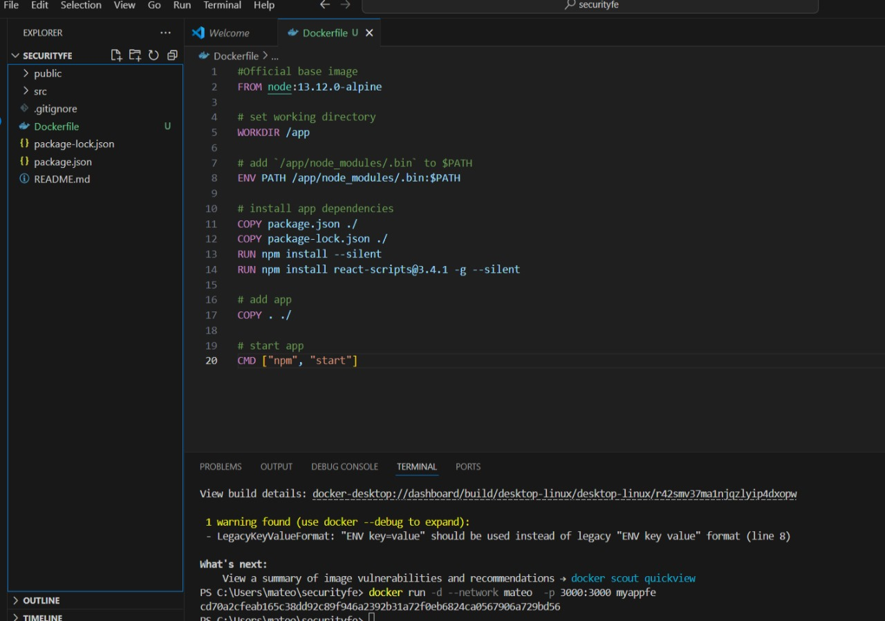
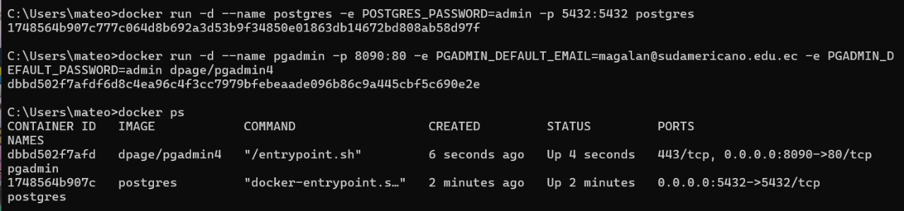
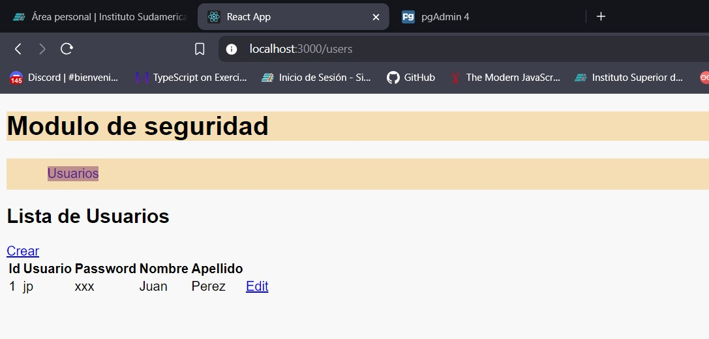

## **Practica sobre la  Aplicación FrontEnd en Docker Mateo Galan**

### **Tiempo de duración**
Esta práctica tuvo una duración aproximada de **75 minutos**.

### **Fundamentos**
#### **Docker** es una plataforma que permite la automatización del despliegue de aplicaciones dentro de contenedores. Los contenedores son entornos ligeros, portátiles y autónomos que pueden ejecutarse en cualquier sistema operativo compatible sin importar las configuraciones del entorno subyacente. Docker facilita la creación, prueba y despliegue de aplicaciones sin preocuparse por las diferencias en los entornos de desarrollo o producción.

#### **React** es una biblioteca de JavaScript utilizada para construir interfaces de usuario interactivas y dinámicas. Al crear aplicaciones con React, los componentes se renderizan de manera eficiente, lo que mejora la experiencia del usuario.

### **Conocimientos previos**
Para realizar esta práctica es necesario contar con conocimientos de:

- **Docker**: Conocimiento de la creación y gestión de contenedores.
- **Comandos Docker**: Uso de comandos básicos de Docker como `docker build`, `docker run` y `docker network`.

---

## **Objetivos a alcanzar**
- **Crear un contenedor Docker para la aplicación FrontEnd React**.
- **Configurar la red de Docker para asegurar la comunicación entre el contenedor FrontEnd y el contenedor BackEnd**.
- **Probar la aplicación FrontEnd, asegurándose de que muestra correctamente los datos obtenidos del BackEnd**.

---

## **Equipo necesario**
- Laptop con conexión a Internet.
- Docker Desktop instalado localmente.

---

## **Material de apoyo**
- Documentación oficial de Docker.

---

## **Procedimiento**
**Paso 1:** Acceder a Docker Desktop y ejecutar los contenedores de postgres y pgAdmin y el del Backend

                                                                                               Ñ

**Paso 2:** Clonar el repositorio del Fronent

                                                                                             

**Paso 3:**  Crear el archivo Dockerfile dentro de la carpeta principal del proyecto:

                                                                                                                        
**Paso 4:** Crear imagen con la app de React

                                                                                              

**Paso 5:** Crear el contenedor a partir de la imagen usando la red conectada a los contenedores :

                                                                                             

**Paso 6:** Porbar el funcionamiento ejecutando "localhost:3000":

## **Resultados esperados**
- **Contenedor Docker creado exitosamente**: La imagen `myappfe` debe ser construida sin errores y estar lista para ser ejecutada.
- **Aplicación FrontEnd corriendo en el puerto 3000**: La interfaz debe ser accesible desde el navegador, mostrando la lista de usuarios obtenida desde el BackEnd.
- **Conexión adecuada entre el FrontEnd y el BackEnd**: Verificar que los datos se muestran correctamente en el FrontEnd, lo que indica que la comunicación entre ambos contenedores es exitosa.

---

## **Bibliografía**

- Docker Inc. (2024). Docker Documentation. Recuperado de [https://docs.docker.com/](https://docs.docker.com/)
- React Documentation (2024). React Official Site. Recuperado de [https://reactjs.org/](https://reactjs.org/)
